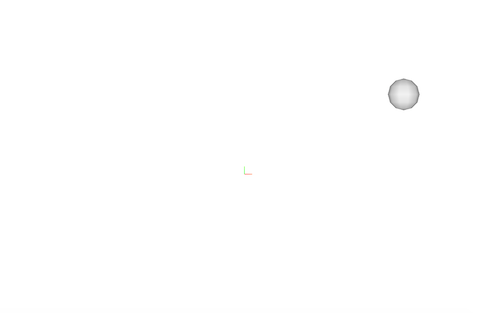
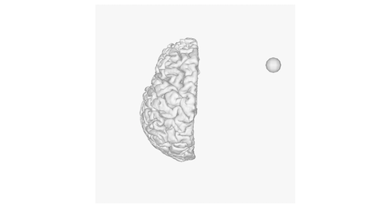
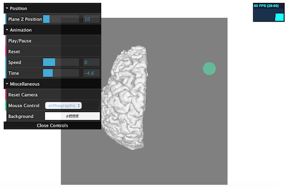
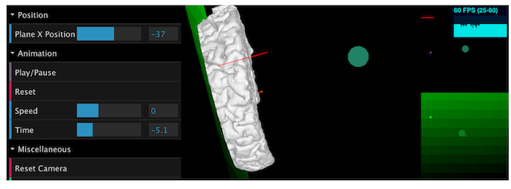

```{r setup, include = FALSE}
knitr::opts_chunk$set(
  collapse = TRUE,
  comment = "#>", 
  eval = FALSE
)
```

`Threejs` is a powerful Javascript library that uses WebGL to render 3D objects in 
html canvas. `Threejsr` provides interface to this library and enables easy 3D 
visualizations in R.

## A Basic Example

To start, let's see the following code

```{r basic example}
library(threejsr)

sphere <- geom_sphere(position = c(100, 50, 200), mesh_name = 'Ball 1', 
                      radius = 10)

threejs_scene(sphere, control_gui = F)
```



`geom_sphere` creates a `GeomSphere` object at $(100, 50, 200)$. This geometry 
name is `Ball 1`. It has radius of `10` and no special rendering. Clicking the 
sphere and you will see its name showing up in the view.

`threejs_scene` functions as "plot", passing all parameters to threejs. Enter 
`?threejs_scene` and you will see a detailed document for how to set control gui, 
how to play animation with different speed, how to initialize main/side cameras 
with different parameters, or show/hide objects via `layer` parameters.

## Geometries

Let's see more examples

```{r geometries}

sphere <- geom_sphere(position = c(100, 50, 200), mesh_name = 'Ball 1', 
                      radius = 10)

plane <- geom_plane(
  position = c(0,0,0), mesh_name = 'plane', width = 256, height = 256, 
  mesh_info = '<span style="color:red">Colored info</span>', 
)


f <- 'https://github.com/dipterix/rave_example_data/raw/master/data/data_dir/demo/sub1/rave/suma/lh.pial.asc'
dat = read.freesurf.asc(f)
brain <- geom_free(position = c(0,0,0), mesh_name = 'freemesh', 
                   vertices = dat$vertices, faces = dat$faces, 
                   hover_enabled = F, # turn this to true if you have a good GPU
                   mesh_info = 'Left Hemisphere')

threejs_scene(sphere, plane, brain, control_gui = F,
              show_stats = T)
```



There are three types of geometries in the first version:

1. GeomSphere class: Sphere with customized radius (sphere in the example). 
`GeomSphere` can be initialized by `GeomSphere$new`, or `geom_sphere`.
2. GeomPlane class: Plane with customized width and height (plane in the 
example). This class can be initialized by `GeomPlane$new` or `geom_plane`
3. GeomFreeMesh class: Any geometry with given vertex positions and face 
indices (brain in the example), initialized by `GeomFreeMesh$new` or `geom_free`.

## Color/Animation

*Currently there is no color rendering method for free geometry*

Let's construct a relative complex example. There is a plane which can move 
along z-axis. It's color changes according to its position. There is also a 
sphere object and it's color changes along time.

```{r animation}
# Plain RGBA animation with transparency
sphere <- geom_sphere(position = c(100, 50, 200), mesh_name = 'Ball 1', 
                      radius = 10)

sphere_data <- data.frame(
  time = -10:10, # 21 frames
  red = (0:20) / 20,
  green = rep(1, 21),
  blue = rev((0:20) / 20),
  alpha = abs(-10:10) / 10
)
sphere$animation_event(
  name = 'ani-sphere', event_data = as.matrix(sphere_data[, -1]), 
  key_frames = sphere_data$time + 10, pixel_size = 4, alpha = T)


# Facy data material for plane
plane <- geom_plane(
  position = c(0,0,0), mesh_name = 'plane', width = 256, height = 256, 
  mesh_info = '<span style="color:red">Colored info</span>', is_clipper = T
)
key_frames = (1:10) * 5
plane_data <- sapply(key_frames, function(k){
  # k is keyframe, or position z of plane
  # we use k as alpha and 
  color_type = floor(k / 17)
  # generate 100 colors
  re = replicate(100, c(0,0,0,k/10))
  re[color_type, ] = seq(0, 1, length.out = 100)
  as.vector(re)
})
dim(plane_data) <- c(4, 100, length(key_frames))
plane_data <- aperm(plane_data, c(3,1,2))
dim(plane_data)

plane$positional_event(
  name = 'ani-plane', event_data = as.vector(plane_data), 
  key_frames = key_frames, axis = 'z', pixel_size = 4, alpha = T
)

plane$add_position_control(
  name = 'ani-plane', axis = 'z', label = 'Plane Z Position', min = 0, 
  max = 11 * 5, initial = 10, step = 1)

f <- 'https://github.com/dipterix/rave_example_data/raw/master/data/data_dir/demo/sub1/rave/suma/lh.pial.asc'
dat = read.freesurf.asc(f)
brain <- geom_free(position = c(0,0,0), mesh_name = 'freemesh', 
                   vertices = dat$vertices, faces = dat$faces, 
                   hover_enabled = F, # turn this to true if you have a good GPU
                   mesh_info = 'Left Hemisphere', clippers = 'plane')


threejs_scene(sphere, plane, brain, control_gui = T, control_collapsed = F,
              keyframe_shift = -10, show_stats = T, fps = 3)
```



## Cameras

One can set multiple cameras to focus on certain objects. Still using the last 
example.

```{r cameras}

# Plain RGBA animation with transparency
sphere <- geom_sphere(position = c(100, 10,-10), mesh_name = 'Ball 1', 
                      radius = 10, layer = 4)

sphere_data <- data.frame(
  time = -10:10, # 21 frames
  red = (0:20) / 20,
  green = rep(1, 21),
  blue = rev((0:20) / 20),
  alpha = abs(-10:10) / 10
)
sphere$animation_event(
  name = 'ani-sphere', event_data = as.matrix(sphere_data[, -1]), 
  key_frames = sphere_data$time + 10, pixel_size = 4, alpha = T)

# Facy data material for plane
plane <- geom_plane(
  position = c(0,0,0), mesh_name = 'plane', width = 256, height = 256, 
  is_clipper = T, layer = 3
)
key_frames = 1:100
plane_data <- sapply(key_frames, function(k){
  # k is keyframe, or position z of plane
  # we use k as alpha and 
  color_type = floor(k / 34) + 1
  # generate 100 colors
  re = replicate(100, c(0,0,0,1-(k/100)))
  re[color_type, ] = seq(0, 1, length.out = 100)
  as.vector(re)
})
dim(plane_data) <- c(4, 100, length(key_frames))
plane_data <- aperm(plane_data, c(3,1,2))

plane$positional_event(
  name = 'ani-plane', event_data = as.vector(plane_data), 
  key_frames = - key_frames, axis = 'x', pixel_size = 4, alpha = T
)

plane$add_position_control(
  name = 'ani-plane', axis = 'x', label = 'Plane X Position', min = -101, 
  max = 10, initial = 0, step = 1)

plane$rotateY(theta = pi / 2)

brain <- geom_free(position = c(0,0,0), mesh_name = 'freemesh', 
                   vertices = dat$vertices, faces = dat$faces, 
                   hover_enabled = F, 
                   mesh_info = 'Left Hemisphere', clippers = 'plane')


threejs_scene(
  sphere,
  plane,
  brain,
  keyframe_shift = -10,
  show_stats = T,
  fps = 3,
  extra_cameras = list(
    list(look_at = sphere, position = c(0, 200, 0)),
    list(look_at = plane, position = c(-200, 0, 0))
  ),
  height = '50vh', 
  background_colors = c('#000000', '#000000')
)
```



The clipping plane changes its color and transparency according to its x position 
and the sphere changes color and transparency according to time. Two side-cameras 
are shown on the right. The first one focuses on the sphere, with position 
`(0,200,0)` relative to the sphere. The second one focuses on the plane, 
`(-200,0,0)` relative to plane's position, no matter how position of plane 
changes.

These three lines define the two side-cameras:

```
extra_cameras = list(
    list(look_at = sphere, position = c(0, 200, 0)),
    list(look_at = plane, position = c(-200, 0, 0)))
```

`extra_cameras` is a list of named list, with its length equaling to the number 
of side cameras. `list(look_at = sphere, position = c(0, 200, 0))` means this 
side camera is looking at sphere object, with relative position at `(0,200,0)`. 
There is no `up` argument in this implementation, and this will be added in the 
future versions.

To enable object visibility in the side cameras, this object must be in the 
layer `3` to `6`, while the main camera can see layers `1` to `4`. The brain is 
at layer `1`, sphere is `4` and plane is `3`. The hover helper, with the red 
line in layer `1` and `3`, the green cube is at layer `6`. This is why the brain 
can not be seen at side cameras and the green cube helper is not visible in the 
main camera, but both sphere and plane are visible, because these two are at 
layer that can be seen by both main and side cameras.

To set layers, you just need to set `layer=*` when initializing the object.
